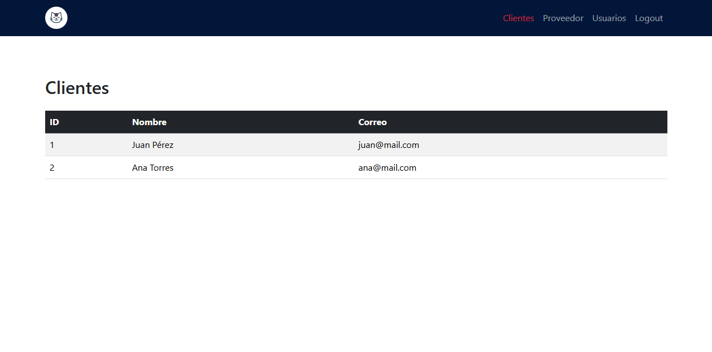

# Panel Administrativo Web con React JS

**Luis Benavides | 2211925**
**Santiago Meneses | 2200255**

Este proyecto es un **Panel Administrativo** desarrollado con **React**, **Vite** y **Bootstrap**. Simula un entorno de administración moderno, minimalista y responsivo, utilizando los colores y estilo basados en el logo proporcionado.

---

## 📸 Captura de pantalla



---

## 🚀 Tecnologías usadas

- [React](https://react.dev/)
- [Vite](https://vitejs.dev/)
- [React Router DOM](https://reactrouter.com/)
- [Bootstrap 5](https://getbootstrap.com/)

---

## 🎯 Funcionalidades

- Barra de navegación fija con logo personalizado.
- Secciones disponibles:
  - **Clientes:** Lista de clientes en tabla.
  - **Proveedor:** Lista de proveedores en tarjetas.
  - **Usuarios:** Tarjetas de usuarios con sus roles.
  - **Logout:** Simulación de cierre de sesión con redirección.
- Diseño responsivo, limpio y minimalista.

---

## 📁 Estructura del Proyecto

```plaintext
/public
  └── logo.png (imagen del logo)
/src
  ├── components
  │   └── Navbar.jsx
  ├── pages
  │   ├── Clientes.jsx
  │   ├── Proveedor.jsx
  │   ├── Usuarios.jsx
  │   └── Logout.jsx
  ├── App.jsx
  ├── main.jsx
  └── index.css (personalizaciones de estilo)
/vite.config.js
/package.json
```

---

## 🛠️ Instalación y ejecución

1. Clona el repositorio:

   ```bash
   git clone https://github.com/tu_usuario/tu_repositorio.git
   cd tu_repositorio
   ```

2. Instala las dependencias:

   ```bash
   npm install
   ```

3. Corre el servidor de desarrollo:

   ```bash
   npm run dev
   ```

4. Abre tu navegador en:
   ```
   http://localhost:5173/
   ```

---

## 📚 Pasos de desarrollo

- Inicialización del proyecto usando `npm create vite@latest`.
- Instalación de Bootstrap y React Router DOM.
- Creación de componentes y páginas.
- Aplicación de estilos minimalistas personalizados en `index.css`.
- Integración de navegación moderna y responsiva.

---

## 📌 Notas

- La sección de **Logout** realiza una simulación de cierre de sesión y redirige automáticamente al inicio.
- Se utilizó un fondo blanco detrás del logo para mejorar su visibilidad en la barra oscura.

---

## 👨‍🏫 Profesor

Carlos Adolfo Beltrán Castro — Escuela de Ingeniería de Sistemas e Informática

---
